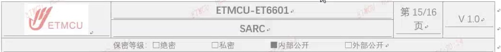

准流程完成后再打开模拟ADC使能：

LRS.SARC.LIMIT.SPEC【07】对虚拟通道vc的配置，需要将对应的vcen关闭后ETNGI 进配置，配置完成后再将vcen打开；CTWCU 

LRS.SARC.LIMIT.SPEC【08】ADC数字控制器的使能信号需要早于控制器内的——上

2022年12月22日

翌创微电子保密信息未经授权禁止扩散 

其他使能信号（比如vcen等）打开；

### 2.5 触发源说明